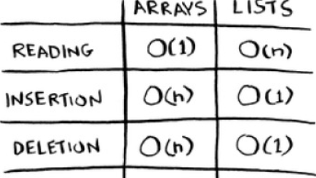

# Arrays Vs. Linked Lists

## About

Pros and cons of Linked Lists and Arrays

**Arrays** are contiguous memory allocation
**Linked Lists** are randomized, first available allocation

## Running Times For Common Operations

